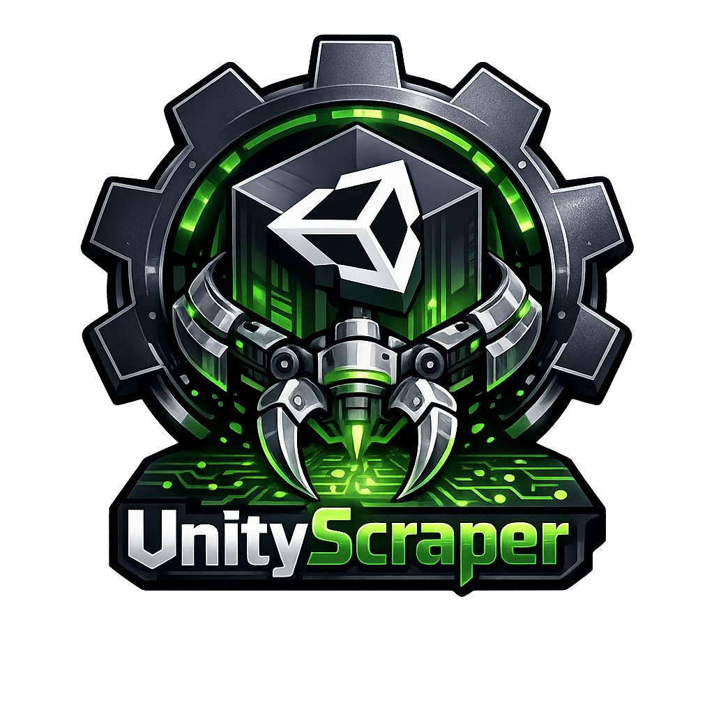

<p align="center">
  
</p>

# UnityScraper

[](https://github.com/TrapEmAll/UnityScraper/actions/workflows/ci.yml)
[](https://github.com/TrapEmAll/UnityScraper/releases)
[](LICENSE)

UnityScraper is a cross-platform Xbox 360 library, knowledge, title-update,
artwork, verification, and backup manager. It combines a local SQLite library
with source-attributed community knowledge and tools for content you already
own.

The project is currently in beta. Preserve a separate copy of important
archives before running large imports or transfers.

## What It Does

### Library and Downloads

- Collects XboxUnity cover and Title Update metadata.
- Caches the XboxUnity title catalog for offline name and TitleID autocomplete.
- Reviews results before selectively downloading files.
- Tracks pending, downloaded, failed, and verified content.
- Supports retries, rate limiting, bandwidth limits, and resumable downloads.
- Verifies local archive records and exports JSON or CSV reports.

XboxUnity endpoints are intentionally **HTTP-only** because that is what the
service exposes. UnityScraper does not silently substitute HTTPS URLs.

### Xbox 360 Knowledge

- Imports TitleID, publisher, region, and Multi-ID references from ConsoleMods.
- Caches and indexes Xbox 360 articles from ConsoleMods, XenonLibrary, and
  Free60.
- Builds a searchable, self-contained offline library from cached or
  browser-saved wiki pages.
- Imports user-supplied Redump and No-Intro XML DAT files.
- Stores entities, identifiers, facts, citations, revisions, import runs, and
  conflicts with provenance.
- Supports per-property source priorities and records explicit conflict
  decisions without deleting competing claims.
- Offers an opt-in app-start refresh schedule with a minimum six-hour interval.
- Fills blank or unknown local metadata without replacing better known values.

### Backup Management

- Inventories Xbox content roots, USB drives, archive folders, and extracted
  `Games` directories.
- Recognizes Games on Demand, Xbox Live Arcade, DLC, Title Updates, extracted
  Xbox 360 games, and original Xbox XBE metadata.
- Installs user-supplied STFS packages into content-aware paths.
- Safely imports ZIP archives and complete
  `Content/0000000000000000` trees.
- Exports selected backups with per-file SHA-256 values and a preservation
  manifest.
- Queues resumable uploads and downloads to a configured Aurora-style FTP server.
- Captures read-only console inventories and compares PC and console content.
- Can opt into remote SHA-256 verification when the selected FTP dashboard
  advertises a compatible read-only hash command.
- Runs a user-selected external ISO converter without bundling converter code.

### Profiles and Save Data

- Discovers profile folders and save packages in extracted Xbox 360 `Content`
  trees.
- Reads public STFS ownership, TitleID, package, and display metadata.
- Associates saves with cached game names and flags profile/TitleID mismatches.
- Detects duplicate save packages by SHA-256.
- Masks profile identifiers by default.
- Creates complete-profile or selected-save snapshots with manifests and
  verified atomic copies.
- Restores snapshots without overwriting different existing files.
- Exports portable JSON preservation manifests.
- Reads extracted XDBF/GPD achievement databases without modifying them.
- Compares save hashes and imported achievement state across two profiles.
- Previews Xenia save mappings and creates a verified snapshot before migration.
- Discovers Xenia or Xenia Canary beside a selected content folder and launches
  user-selected games directly without constructing a shell command.

The profile/package model is informed by Dalavin, also known as DJ
SkunkieButt, and the GPLv3 X360 library and Le Fluffie source. See
[PROFILES_AND_SAVES.md](PROFILES_AND_SAVES.md),
[PROFILE_INTELLIGENCE.md](PROFILE_INTELLIGENCE.md), and
[THIRD_PARTY_NOTICES.md](THIRD_PARTY_NOTICES.md).

### External Tools

- Provides a unified Tool Center for Xbox community utilities.
- Includes XeXTool 6.3 by xorloser for basic or extended XEX information on
  Windows.
- Adds native workflows for extract-xiso, Xenia, and Xenia Canary.
- Detects, verifies, and launches user-supplied Velocity, Iso2God, God2ISO,
  Xbox Image Browser, and Le Fluffie installations.
- Supports custom executables and argument templates for additional tools.
- Shows the exact command, captures standard output and errors, and supports
  cancellation and timeouts.
- Executes argument vectors directly without using a command shell.

The bundled executable was sourced from
[XboxChef/XexToolGUI](https://github.com/XboxChef/XexToolGUI). A locally
selected XeXTool build or another trusted utility can still be used instead.
See [EXTERNAL_TOOLS.md](EXTERNAL_TOOLS.md) and
[THIRD_PARTY_NOTICES.md](THIRD_PARTY_NOTICES.md) for provenance, credits,
checksums, platform notes, and safety guidance.

### Collection Intelligence and Preservation

- Discovers mounted console, USB, and archive storage.
- Parses XEX2 identity fields and imports Aurora databases read-only.
- Compares installed content with catalogued updates using exact MediaIDs.
- Scores collection health and creates non-destructive repair-plan previews.
- Matches local hashes against user-imported Redump and No-Intro DAT metadata.
- Exports preservation manifests, offline HTML reports, and fact provenance.
- Keeps local metadata overrides separate from source-attributed knowledge.

### Community Hub

- Searches games, knowledge, profiles, saves, achievements, files, and tools
  together from the local database.
- Extracts structured hardware, dashboard, exploit, error, format, repair, and
  tool records from cached source articles while retaining provenance.
- Builds console sync previews and queues confirmed uploads through the durable,
  resumable transfer engine.
- Adds profile dashboards, read-only package workspaces, ownership previews,
  save comparison, played-title history, and validated GPD image export.
- Manages preferred artwork, multi-disc audits, recoverable duplicate cleanup,
  read-only FATX geometry inspection, original Xbox discovery, plugins, and recovery.
- Runs long Community Hub operations outside the interface thread, opens unified
  search results in their native workspace, and restores quarantined duplicates.
- Inventories STFS file tables in read-only package workspaces without claiming
  unsupported package rebuilding or signing.
- Extracts supported consecutive STFS files read-only with path validation,
  output limits, atomic files, hashes, and a manifest.
- Stores high-contrast, large-text, reduced-motion, and keyboard-hint settings.
- Exports and imports non-personal metadata snapshots, audits incomplete library
  metadata, creates preservation reports and correction packages, and records
  local hardware notes.

### Desktop Style

The desktop uses a Visual Studio 2010-inspired dark tool aesthetic: compact
square controls, charcoal chrome, blue selection and focus states, classic menu
commands, dense tables, and status bars. The primary and Advanced Tools windows
share the same theme, with high-contrast and large-text alternatives retained.

See [COMMUNITY_HUB.md](COMMUNITY_HUB.md) for all twenty capabilities and their
safety boundaries.

## Install

### Windows Release

Download the latest ZIP and checksum from
[GitHub Releases](https://github.com/TrapEmAll/UnityScraper/releases). Verify
the SHA-256 file, extract the ZIP, and run `UnityScraper.exe`.

Release executables are generated by GitHub Actions. Built binaries are not
stored in the source tree.

### Linux Release

Download the Linux x86_64 tarball and checksum from GitHub Releases:

```bash
sha256sum --check UnityScraper-Linux-x86_64.tar.gz.sha256
tar -xzf UnityScraper-Linux-x86_64.tar.gz
cd UnityScraper-Linux-x86_64
./install.sh
```

The user-level installer adds UnityScraper to the desktop application menu and
creates `~/.local/bin/unityscraper`. It does not require root access. See
[LINUX.md](LINUX.md) for supported distributions, XDG paths, source setup,
uninstallation, and troubleshooting.

### macOS Preview

CI produces an unsigned Apple Silicon `.app` archive and SHA-256 checksum. It
is currently a preview artifact and is not notarized. See [MACOS.md](MACOS.md)
for installation, source setup, and known limitations.

### Run From Source

Requirements:

- Python 3.10 or newer
- Tkinter

Clone the repository and run:

```powershell
.\setup.bat
.\Run-UnityScraper.bat
```

Manual setup:

```powershell
python -m venv .venv
.\.venv\Scripts\python.exe -m pip install -r requirements.txt
.\.venv\Scripts\python.exe desktop_app.py
```

The primary interface is `desktop_app.py`. `GUI.py` remains available from
**Advanced Tools** for older scraper controls.

Linux source setup:

```bash
./setup.sh
./run-unityscraper.sh
```

## Application Workspaces

| Workspace | Purpose |
| --- | --- |
| Library | Browse games, covers, MediaIDs, and available updates |
| Add Games | Search cached game names, select TitleIDs, or import lists |
| Downloads | Review and manage download activity |
| Backup Manager | Scan, install, verify, export, convert, and transfer owned content |
| Profiles & Saves | Inventory profiles, inspect achievements, compare, snapshot, restore, and migrate to Xenia |
| Tool Center | Run and manage supported Xbox 360 community utilities |
| Collections | Identify storage, compare Title Updates, verify preservation data, and preview repairs |
| Knowledge | Search sources, facts, citations, imports, and conflicts |
| Community Hub | Unified search, console plans, profiles, preservation, plugins, recovery, compatibility, and release toolkit |
| Archive Health | Find missing or inconsistent downloaded files |
| Settings | Configure storage and scraper behavior |
| Help & About | Version, diagnostics, storage, and advanced tools |

## Storage and Portable Mode

Normal Windows installations store writable data under:

```text
%LOCALAPPDATA%\UnityScraper
```

This includes the database, configuration, logs, downloads, exports, source
cache, and diagnostics.

Linux follows the XDG Base Directory specification:

```text
Data:   ${XDG_DATA_HOME:-~/.local/share}/unityscraper
Config: ${XDG_CONFIG_HOME:-~/.config}/unityscraper
Cache:  ${XDG_CACHE_HOME:-~/.cache}/unityscraper
Logs:   ${XDG_STATE_HOME:-~/.local/state}/unityscraper/logs
```

To enable portable mode, create an empty file named `portable.mode` beside the
source entry point or packaged executable before launch. Portable data is
written to `UnityScraperData` beside the application. The marker and runtime
data are ignored by Git.

## Command Line

Display every option:

```powershell
python main.py --help
```

### XboxUnity Metadata

```powershell
# Refresh every XboxUnity title name for local autocomplete
python main.py --sync-title-catalog

# Collect metadata for one or more TitleIDs
python main.py 4D5307E6 --metadata-only

# Load the bundled/user TitleID list in metadata-only mode
python main.py

# Verify downloaded files recorded in SQLite
python main.py --verify-integrity
```

Providing TitleIDs without `--metadata-only` starts the download workflow.
Review the destination and settings before doing this.

The desktop application refreshes the XboxUnity title catalog in the
background when the local copy is missing or more than seven days old. The
**Add Games** search box always queries SQLite, so suggestions remain fast and
available offline. Suggestions include the game name, TitleID, and content
type. Use **Refresh Catalog** on that page to request an immediate update.

Catalog names fill only blank, unknown, or accidentally TitleID-shaped game
names. Existing user names and better source-attributed metadata are preserved.

### Knowledge Sources

```powershell
# TitleID and Multi-ID enrichment
python main.py --sync-knowledge

# Cache and index reference wikis
python main.py --sync-wikis

# Limit a first test sync per source
python main.py --sync-wikis --wiki-limit 25

# Build or refresh the local offline reading library
python main.py --build-offline-knowledge

# Import a page, folder, or ZIP saved in a browser when a wiki blocks automation
python main.py --import-saved-wiki "C:\Saved Wikis" --saved-wiki-source xenonlibrary

# Import a user-downloaded preservation DAT
python main.py --import-dat "D:\DATs\xbox360.dat" --dat-source redump
```

ConsoleMods and XenonLibrary may require Cloudflare browser verification and
return HTTP 403 to command-line clients. UnityScraper does not bypass that
protection. It continues using the last successful cache and identifies the
blocked source clearly. In the **Knowledge** workspace, use **Import Saved Wiki
Pages** for pages saved through a normal browser, then **Open Offline Library**
to browse the local copy. The offline renderer keeps article text, source
links, timestamps, and license attribution while excluding remote scripts and
trackers.

### Backup Manager

```powershell
# Inventory a target and write a report
python main.py --scan-backups E:\ --backup-report inventory.json

# Install a bare STFS package
python main.py --install-package game.live --backup-target E:\

# Import supported packages or a validated content tree from ZIP
python main.py --import-package-zip archive.zip --backup-target E:\

# Structurally verify a target
python main.py --verify-backups E:\ --backup-report health.json

# Upload a package to a console on a trusted local network
python main.py --ftp-upload game.live --ftp-host 192.168.1.50
```

See [BACKUP_MANAGER.md](BACKUP_MANAGER.md) for layouts, conflict behavior,
manifests, FTP considerations, and external converter arguments.

### Collections and Console Sync

```powershell
# Analyze a collection and create offline reports
python main.py --analyze-collection D:\Xbox360 `
  --collection-manifest collection.json `
  --collection-html collection.html

# Read an Aurora database without modifying it
python main.py --aurora-db content.db --collection-manifest aurora.json

# Match a local file against imported preservation DAT hashes
python main.py --match-file game.iso

# Capture a read-only console inventory
python main.py --ftp-host 192.168.1.50 --ftp-snapshot /Hdd1

# Search every local knowledge domain
python main.py --search-all "Hitman"

# Inspect FATX geometry or an Xbox 360 USB container without writing it
python main.py --audit-storage E:\drive.img

# Preview duplicate recovery actions, then apply or restore one explicitly
python main.py --dedup-preview D:\XboxArchive
python main.py --dedup-apply 42 --dedup-mode quarantine
python main.py --dedup-restore 42

# Share or consume a non-personal offline metadata snapshot
python main.py --metadata-snapshot-export xbox360.usmeta
python main.py --metadata-snapshot-import xbox360.usmeta

# Audit the library and produce a privacy-conscious report
python main.py --library-audit
python main.py --preservation-report preservation.html

# Extract supported files without changing the STFS source package
python main.py --extract-stfs save.con --extract-destination extracted
```

## Optional REST API

Start the localhost-only API:

```powershell
python main.py --api-mode
```

Binding beyond localhost requires an API token:

```powershell
$env:UNITYSCRAPER_API_TOKEN = "replace-with-a-long-random-token"
python main.py --api-mode --api-host 0.0.0.0
```

Clients send the token as `Authorization: Bearer <token>` or `X-API-Key`.
Multiple scoped tokens can be provided through `UNITYSCRAPER_API_TOKENS` as a
JSON object whose values contain `read`, `write`, or `transfer`. Requests are
rate-limited per client.
Remote HTTP is not encrypted; place it behind a trusted local reverse proxy or
use it only on an isolated network. See [API.md](API.md).

See [RELEASE_TOOLKIT.md](RELEASE_TOOLKIT.md) for metadata snapshot privacy,
library intelligence, reports, corrections, hardware records, and STFS
extraction boundaries.

## Build and Test

Install development dependencies:

```powershell
.\.venv\Scripts\python.exe -m pip install -r requirements-dev.txt
```

Run the same high-signal checks used in CI:

```powershell
.\.venv\Scripts\python.exe -m ruff check .
.\.venv\Scripts\python.exe -m compileall -q .
.\.venv\Scripts\python.exe tests.py
```

Build the Windows executable:

```powershell
powershell -ExecutionPolicy Bypass -File .\build_windows.ps1
```

The output appears under `dist\` and is ignored by Git.

Build the Linux release bundle on Linux:

```bash
./build_linux.sh
```

The output is `dist/UnityScraper-Linux-<architecture>.tar.gz` with a matching
SHA-256 file.

Build the macOS application bundle on macOS:

```bash
./build_macos.sh
```

## Documentation

- [Documentation index](DOCS_INDEX.md)
- [Architecture](ARCHITECTURE.md)
- [Modularization plan](MODULARIZATION_PLAN.md)
- [Linux support](LINUX.md)
- [macOS preview](MACOS.md)
- [Community Hub](COMMUNITY_HUB.md)
- [Knowledge sources and licensing](KNOWLEDGE_SOURCES.md)
- [Backup manager](BACKUP_MANAGER.md)
- [Collection intelligence](COLLECTION_INTELLIGENCE.md)
- [Console sync](CONSOLE_SYNC.md)
- [Plugin API v1](PLUGIN_API.md)
- [REST API](API.md)
- [Project status](PROJECT_STATUS.md)
- [Changelog](CHANGELOG.md)
- [Contributing](CONTRIBUTING.md)
- [Security policy](SECURITY.md)

## Project Boundary

UnityScraper catalogs public knowledge and operates on files supplied by the
user. It does not bundle or download:

- Commercial game images or copyrighted game payloads
- Xbox firmware or dashboard files
- Encryption keys
- Leaked SDK material
- Copy-protection bypass tools

Respect source licenses, service capacity, local law, and the rights of content
owners. Do not attach private paths, credentials, keys, or copyrighted data to
bug reports.

## Sources and Attribution

Imported knowledge remains linked to its source and stated license. ConsoleMods,
XenonLibrary, Free60, Redump, No-Intro, and XboxUnity are independent projects
and are not affiliated with UnityScraper.

The backup workflow was informed by
[TinyXbox360BackupManager](https://github.com/jeanmatthieud/TinyXbox360BackupManager).
UnityScraper uses an independent Python implementation and does not copy or
bundle that GPL-3.0-only project's Rust source.

## License

UnityScraper is licensed under GPL-3.0-only. See [LICENSE](LICENSE).
